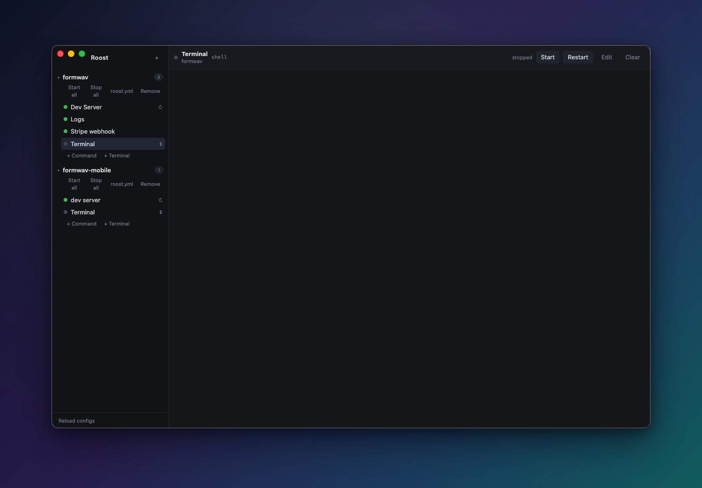

# Roost

A small macOS app that runs your project's commands and keeps them running.



Every project gets a `roost.yml` listing the commands it needs — a dev server, a
log tail, a queue worker, a webhook forwarder. Roost starts them when it launches,
gives each one a real terminal, brings them back when they crash, and puts a
coloured dot in your menu bar so you know at a glance whether anything is down.

- **A real terminal per command.** Colour, cursor keys, and typing into a running
  process all work. Each command keeps its own scrollback while you switch away.
- **Auto-restart.** A command marked `auto_restart` comes back a second after it
  dies, and stops retrying after five crashes in ten seconds so a broken command
  can't spin forever.
- **Edited in the app.** Add, change, and delete commands without opening a file.
  Changes are written back to `roost.yml`, so hand-edits and in-app edits agree.
- **Out of the way.** Closing the window hides Roost to the menu bar and leaves
  everything running.

Requires macOS. Built and tested on Apple Silicon.

## Installing it

```
npm install
npm run make
cp -R out/Roost-darwin-*/Roost.app /Applications/
open /Applications/Roost.app
```

The build is unsigned. A locally built app is not quarantined, so it opens
normally. Move the zip from `out/make/` to another Mac and Gatekeeper will block
it until you right-click the app and pick Open.

## Config

Each project keeps its commands in a `roost.yml` at its root. Roost reads nothing
else, and creates the file the first time a project needs one.

```yaml
name: acme-api
processes:
  Dev Server:
    command: composer dev
    auto_start: true
    auto_restart: true
  Logs:
    command: tail -f storage/logs/laravel.log
    auto_start: true
    auto_restart: false
  Worker:
    command: php artisan queue:work
    working_dir: services/queue
    auto_restart: true
    env:
      QUEUE_TRIES: '3'
```

| Key | What it does |
| --- | --- |
| `command` | What to run. Required |
| `working_dir` | Relative to the project folder, or absolute. Leave it out to run in the project folder |
| `auto_start` | Start this when Roost launches |
| `auto_restart` | Bring it back 1s after a crash, giving up after 5 crashes in 10s |
| `env` | Extra environment variables for this command |
| `kind` | `terminal` for a plain shell. Leave it out for a normal command |

### Editing from the app

Hover a command in the sidebar and hit the pencil, double-click it, or use
**Edit** in the toolbar. **+ Command** and **+ Terminal** sit under each project.
The **✕** on a hovered row deletes it behind a confirm.

Saving writes `roost.yml`. A command that was already running restarts on its new
settings, and deleting one that is running stops it first. The **roost.yml**
button opens the file in Cursor.

### Terminals

A terminal is a command like any other, marked `kind: terminal`. It opens a plain
login shell in the project folder and runs nothing until you type.

```yaml
  Terminal:
    command: /bin/zsh
    kind: terminal
```

## Where commands run

Every command runs in its project folder. `composer dev` under a project at
`/Users/you/code/acme-api` starts with that as its working directory, the same as
if you had `cd`'d there yourself. Set `working_dir` to move it: a relative path
resolves from the project folder, an absolute path is used as given. A
`working_dir` that does not exist marks the command crashed and says so in its
terminal, instead of quietly running somewhere else.

Commands run through an interactive login shell (`$SHELL -l -i -c`). Both flags
matter: `-l` reads `.zprofile`, `-i` reads `.zshrc`. Version managers like nvm,
rbenv, and pyenv usually set up PATH in `.zshrc`, so dropping `-i` leaves a
command looking at whatever happens to sit in `/opt/homebrew/bin` — often an old
build that no longer runs.

A **Terminal** entry is that same shell, so whatever works when you type it there
works as a command.

## Menu bar

The dot shows the worst state across every project:

| Colour | Meaning |
| --- | --- |
| green | everything that should be running is running |
| amber | something with `auto_start` is sitting stopped |
| red | something crashed |
| grey | nothing is running |

The menu drills into each project to show a command, restart it, or start and
stop the whole project. Quitting from there — or Cmd+Q — kills every command on
the way out.

## Development

```
npm start          # run from source
npm test           # config, working directory, and process lifecycle
npm run typecheck
```

`ROOST_NO_AUTOSTART=1 npm start` launches without starting anything, which is
handy when something else already holds the ports.

Running `npm start` while the installed app is open gives you two Roosts fighting
over the same commands. Quit one first.

There is a fourth test, `npm run test:path`, that checks a spawned command
resolves the same `node`, `npx`, and `git` an interactive login shell does. It
reads your real shell setup, so it lives outside `npm test`. Point it somewhere
with `ROOST_TEST_PROJECT=/path/to/project`.

### The icon

`assets/icon.svg` holds the icon. Edit it, then `npm run icons`: QuickLook
rasterises it at every size macOS wants and `iconutil` builds `assets/Roost.icns`.
To check one size without rebuilding the app:

```
qlmanage -t -s 32 -o /tmp assets/icon.svg && open /tmp/icon.svg.png
```

Look at 16 and 32 as well as 512. The Dock and the menu bar are where an icon
falls apart.

## Layout

```
src/main.ts                    app lifecycle, window, IPC
src/main/config.ts             project registry and roost.yml
src/main/process-manager.ts    pty spawning, auto-restart, output buffers
src/main/tray.ts               menu bar icon and menu
src/preload.ts                 the window.roost bridge
src/renderer/App.tsx           sidebar and toolbar
src/renderer/ProcessEditor.tsx the add/edit sheet
src/renderer/terminal-pool.ts  one xterm per command, kept alive across switches
assets/icon.svg                the app icon
scripts/make-icons.mjs         regenerates the tray PNGs
scripts/make-appicon.mjs       rasterises assets/icon.svg into assets/Roost.icns
scripts/stage-pty.mjs          prunes node-pty for packaging
```

## Two things the build has to work around

**node-pty ships outside the asar**, at `Contents/Resources/node-pty`. It needs an
executable `spawn-helper` next to its native module, and nothing keeps its
executable bit inside an asar. Forge's Vite plugin also prunes `node_modules` on
the way in, so the module would be missing entirely. `scripts/stage-pty.mjs`
copies the four files that matter into `.pty-dist/`, and `forge.config.ts` ships
that through `extraResource`.

**The icon is named `Roost.icns`**, not the `electron.icns` every Electron app
ships. macOS caches an app's icon against that path, so a rebuilt `electron.icns`
keeps showing the previous artwork in the Dock. A `postPackage` hook renames it
and repoints `CFBundleIconFile`. If a stale icon survives anyway:

```
/System/Library/Frameworks/CoreServices.framework/Frameworks/LaunchServices.framework/Support/lsregister -f -R /Applications/Roost.app
touch /Applications/Roost.app
killall Dock Finder
```

## Licence

MIT. See [LICENSE](LICENSE).
